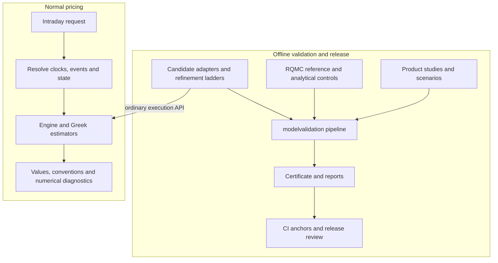

# Intraday engine certification through modelvalidation

Date: 2026-09-18. Status: **Specification for implementation.** The certification policy below was explicitly requested by the user; the detailed migration has not been implemented by this document. Revised the same day after review with five user rulings: a certificate constrains the release, never the code; RQMC is the reference and no bespoke reference is built unless a study cannot proceed without one; the daily-KI Gate C plan is retired into the unified standard; the runtime carries no certification vocabulary at all; scenarios follow the declarative modelvalidation case pattern. Revised again after the plan review (`docs/superpowers/reviews/intraday-modelvalidation-plan-2026-09-18/REVIEW.md`): two scenario descriptions corrected against the runtime, and the identity, substream, convergence, aggregate, per-output status, amendment and banking rules made explicit.

Source baseline: `5bd9671d` on `worktree-intraday-plan1`. Existing daily-KI design and plan files, numerical evidence, and local example work remain intact.

## 1. Decision and precedence

**Certify engines offline by product and scenarios in `quantark.modelvalidation`; use those engines without additional certification checks during pricing.**

The release procedure is:

```text
Product + scenario study + candidate configurations
    -> independent reference and numerical convergence evidence
    -> shared modelvalidation gates and candidate decisions
    -> banked certificate, reports and CI anchors
    -> release and ordinary engine use
```

There is no certificate-to-pricing permission step. `value_intraday`, session pricing, batch pricing, spot curves, portfolio aggregation, and Greek calculation must not read a certificate, match a request against evidence, or run a certification gate. Neither a startup registration check nor a cached admission token may replace the removed per-request checks.

A certificate constrains the release procedure, not the code. In development, test and standalone studies an engine is usable whatever its latest decision, including `REJECTED` and `INCONCLUSIVE`; that is how a researcher investigates it. A production release ships an engine only for the product studies in which a banked certificate admits its shipped configuration. Which engines a release contains is decided and recorded by the release process; no code path reads that decision, and code that could tell the two environments apart would be a runtime gate by another name.

This decision supersedes the runtime qualification requirements in the [original intraday design](2026-09-15-intraday-pricing-design.md), the [daily-KI design](2026-09-17-intraday-daily-ki-certification-design.md), and the runtime applicability matcher recommended in the [2026-09-18 research review](../reviews/intraday-certification-2026-09-18/RESEARCH.md). Their economic conventions, numerical findings and historical evidence remain useful. They no longer prescribe runtime certificate matching. The [daily-KI implementation plan](../plans/2026-09-17-intraday-daily-ki-certification.md) is retired from Task 3 onward: its pilot, sweep, evidence packaging, matrix regeneration and certificate documentation build exactly the artifacts this migration deletes, and its Gate C records lack the schema-2 fields of section 5.2, so no further Gate C sweep is launched. The daily-KI contract, its fixture and the near-KI example carry into the unified study below.

This is an ownership and release-policy migration. Removing a gate does not fix a gamma error or turn a previous inconclusive measurement into a pass.

## 2. Scope and invariants

The migration covers all intraday certification: reference implementations, reference qualification, product fixtures, scenario declaration, candidate ladders, error budgets, decisions, evidence schemas, reporting, banking, amendments and anchors. These belong to `modelvalidation`, its examples, its tests, and its documentation.

The following requirements are mandatory:

1. Intraday uses the same `CertificationStudy` pipeline, builder registry, `run`/`amend`/`anchors` commands, certificate format, reports and decision names as other engines. There is no replacement intraday certificate service, runner or registry.
2. Certification identifies a product, model, scenario suite, quantities, engine implementation and resolved configuration. It is release evidence for that declared study, not permission for one trade, one timestamp or one spot.
3. Runtime pricing has no dependency on banked evidence or on `quantark.modelvalidation`. Successful execution is possible when no certificates or certification tooling are installed or accessible.
4. Studies evaluate the same estimators used by normal pricing. Remove `certify=True/False` and equivalent bypasses; validation does not need a privileged execution path.
5. Keep input, model and algorithm validity checks. Missing fixings, future checkpoints, unsupported monitoring, non-finite calculations, failed solves and genuinely undefined derivatives still produce the appropriate error or result status.
6. Preserve the distinction between point derivatives and finite desk moves, including units, bump sizes, frozen-market rules and actual theta steps.
7. Preserve historical evidence and existing shared certificates. Do not relabel old Gate C results as `ADMITTED`, overwrite certificate digests, or modify old study semantics in place.
8. Numerical budgets are requirements fixed before candidate evaluation. Do not widen them, drop difficult cases, or change defaults solely to obtain admission.

New pricing models, new monitoring operators, payoff changes, and numerical fixes are outside this migration unless separately identified and certified. In particular, continuous-monitoring QUAD remains unsupported where its intraday interval crossing operator is not implemented.

## 3. Architecture and ownership



There is deliberately no dependency from runtime to the offline block. The shared package may import pricing code to evaluate candidates; pricing code may not import the shared package to decide whether an output is allowed.

| Owner | Responsibilities after migration |
|---|---|
| `quantark.intraday` | Timestamp resolution, immutable pricing context, lifecycle and cash ledger, route dispatch, price and Greek algorithms, numerical diagnostics, functional capability descriptions |
| `quantark.modelvalidation` | Shared study definitions, reference and candidate protocols, uncertainty accounting, gates, decisions, provenance, checkpointing, reports, amendments and anchors |
| `quantark.modelvalidation.builders` | Product-specific intraday study adapters: markets, schedules, states, candidate configurations, and the intraday RQMC reference beside each product's candidates, following the existing `equity.snowball.mc_rqmc` pattern; no separate reference package |
| `example/modelvalidation` | Declarative product studies and documented commands |
| `test/modelvalidation` | Reference controls, study/runner tests, gate tests, banked evidence guards and deterministic anchor replay |
| `test/intraday` | Runtime behavior, clocks, fixings, state, cashflow, estimator semantics and integration regressions |
| `docs/modelvalidation` | Release procedure, current certificate bank and clearly separated historical evidence archive |

Do not keep production study builders importing `test.intraday`, and do not move the pricing estimators themselves into validation. Small fixtures needed by runtime semantic tests can remain test-local; expensive certification orchestration cannot.

## 4. Product studies and coverage

### 4.1 Unit of certification

A candidate decision belongs to `(study, candidate configuration)`. A study specifies product and monitoring variants, model assumptions, all required scenarios and quantities, reference policy and tolerances. The certificate records all of these explicitly.

Use product builders in the existing registry, for example `equity.snowball.intraday.pde` and `equity.snowball.intraday.quad_v2` as candidates and `equity.snowball.intraday.mc_rqmc` as the reference. These names register offline builders only. Runtime engine registration must not consult them.

The first complete migration study is `snowball-intraday-daily-ki-bsm`, defined by `example/modelvalidation/snowball_intraday_daily_ki_bsm.yaml`. PDE and QUAD V2 are separate candidates; their default and refined configurations receive separate names and decisions. Passing at a refined configuration does not admit the default configuration.

Other product suites use the same pattern:

| Product family | Required study distinctions |
|---|---|
| Snowball | Daily discrete KI, other discrete schedules, continuous KI where implemented, long remaining gaps, already-KI and terminated states |
| Phoenix | Coupon and KI/KO schedules, coupon memory, missed coupons, pending and overdue contractual cashflows |
| KO-reset Snowball | Reset terms, absolute post-KI schedules, checkpoint/state handoff |
| Digital | Terminal fixing, positive and zero remaining variance, expiry phase and pending settlement |
| Barrier and one-touch | Discrete, terminal and supported continuous monitoring as distinct cases; analytical formula coefficient restrictions |

The migration inventory must account for every existing Gate C fixture and claimed output, including analytical and MC routes. Shared-kernel reuse is not evidence for an untested product. A study can bank an inconclusive result; the release report must distinguish that from an admitted claim. Functional runtime capability remains independent of this report.

### 4.2 Daily-KI scenarios in the modelvalidation pattern

Scenarios follow the declarative pattern of the existing studies such as `example/modelvalidation/snowball_flat_bsm.yaml`: one study-level product, environment and intraday context, then a list of named cases, each overriding the few parameters that make it a distinct numerical situation, each with a comment stating why it exists. There is no scenario generator, no axis product and no separately banked expansion: the YAML is the frozen case list and its digest enters the certificate. A case that cannot be justified in one sentence does not belong in the study.

The study-level contract is the existing daily-KI fixture: initial/strike 100 on 2026-03-16, maturity 2027-03-16, KO 103 on the twelve monthly dates, KI 75 at every SSE close, 12% coupon and rebate, no principal, flat volatility 20%, rate 3%, yield 1%, the SSE session calendar and the `desk` variance profile. The study-level context is the valuation instant 2026-09-10 14:00 +08:00, one hour before an ordinary KI close, at spot 100. Intraday adds a `context` block to the case schema (section 5.2) that a case overrides the same way it overrides `environment` or `product`.

The first revision declares the quantities `pv`, `desk_delta`, `desk_gamma`, `desk_theta`, `point_delta` and `point_gamma`. Point cells the RQMC reference cannot resolve are reported `UNRESOLVED` (section 6.1); they are not dropped to improve the decision.

The first revision of `snowball_intraday_daily_ki_bsm.yaml` declares the 23 cases below. The table specifies intent; the implementation plan fixes exact spots, instants and checkpoint contents and records each reason in the YAML.

| Case | Override | Why it exists |
|---|---|---|
| `ordinary` | none | Interior spot one hour before an ordinary KI close: the smooth baseline every other case is read against |
| `near_ki_above` | spot 75.20 | Just above the daily KI barrier an hour before it is observed; the value function turns over here |
| `near_ki_below` | spot 74.90 | Just below the barrier an hour before the close. The fixing is still ahead, so nothing is decided: an alive claim whose spot sits under the level it will be observed against. A future fixing is never history |
| `near_ki_1s` | spot 75.20, 14:59:59 | One second before the fixing: the transition is narrower than any desk bump, which is where a point Greek and a desk move part company |
| `near_ki_10s`, `near_ki_5m` | spot 75.20, 14:59:50 and 14:55 | Intermediate horizons, so convergence in time-to-event is observed rather than inferred from two ends |
| `near_ko_on_ko_day` | 2026-09-16 14:00, spot 102.90 | A simultaneous KI/KO close; the KO discontinuity sits inside the bump stencil |
| `near_ko_on_ko_day_1s` | 2026-09-16 14:59:59, spot 102.90 | The same discontinuity one second out |
| `ko_level_on_ki_day` | spot 102.90 on 2026-09-10 | The same spot on a day that observes no KO: the difference isolates the KO event from the spot level |
| `pre_open` | 09:00 | Inside the overnight segment, which under `desk` carries 25% of the day's variance at a far lower rate than a session; theta and the clock coefficients must stay inside it |
| `lunch_break` | 12:00, spot 76 | Inside the lunch break, under `desk` a low-variance segment (5% of the day over 90 minutes), not a zero-variance one |
| `lunch_break_zero_variance` | 12:00, spot 76, `sessions_only` | The zero-variance control: the same instant under the profile whose break carries no variance at all |
| `holiday_eve` | 2026-09-30 14:00, spot 76 | The close before a multi-day exchange holiday: the next fixing lies across a folded overnight of several calendar days |
| `maturity_day` | 2027-03-16 14:00, spot 100 | The last observation: KO, KI and terminal payoff resolve together |
| `already_ki` | checkpoint with KI hit on an earlier close, spot 90 | Post-KI dispatch: the knocked-in claim with no KI barrier remaining |
| `terminated_pending_cash` | a fixing of 104 on the 2026-08-17 KO date, 30-day settlement lag | PV is the pending ledger only; the spot derivatives are exactly zero |
| `provisional_ki_after_close` | 15:00:30 under `after`, spot 74.90, no fixing supplied for that close | A due observation that is genuinely missing: the runtime assumes the latest spot, which below the barrier is a provisional knock-in every arm must price |
| `on_ki_barrier_at_close` | 15:00:00 under `before`, spot 75.00 | The point derivatives and a local theta do not exist here; the case carries the semantic assertions that say so |
| `low_vol`, `high_vol` | vol 0.12, vol 0.35, on `near_ki_above` | The transition width scales with volatility, so the near-barrier case is re-examined at both ends |
| `carry` | rate 0.05, yield 0.03 | Distinct rate and carry levels exercise the integrated drift in the interval moments |
| `uniform_profile`, `sessions_only_profile` | profile override on `near_ki_above` | Each supported clock, with its coefficients recorded |

Cases are added or changed only by a new study revision; a failed run cannot shrink its list retrospectively. Every case declares the same quantities. A quantity a case cannot define carries a semantic assertion with the expected status and reason; such cells are neither inserted as zero, omitted after evaluation, nor counted as numeric passes, and an unexpected undefined result in a numeric cell blocks admission. Semantic assertion results are reported with the study and must pass for release.

Every numeric claim includes PV as well as the requested Greeks. An error in PV that cancels under differentiation must remain visible.

Finite scenario coverage provides empirical evidence over the declared study. Neither the certificate nor runtime documentation may describe it as a proof of a uniform error bound for every possible contract and market.

## 5. Quantities and shared schema changes

### 5.1 Explicit estimands

The current shared schema accepts only `pv`, `delta` and `gamma`. Introduce a shared schema 2 with quantity definitions; do not put intraday interpretation into magic quantity strings in report code.

Each quantity definition contains a stable ID, output field, convention, raw unit, economic scaling rule, bump/step specification where relevant, and cashflow scope. Point and desk versions have distinct IDs, for example `point_gamma` and `desk_gamma`; `price` is mapped to the shared `pv` ID.

| Quantity | Target |
|---|---|
| `pv` | Total request PV with contingent claim and pending ledger reconciled |
| Point delta/gamma | First/second spot derivatives at the requested spot, holding the declared conditional state and other inputs fixed |
| Desk delta/gamma | The declared central finite differences at the recorded absolute/relative spot bumps |
| Point vega/rho/dividend rho | Local market sensitivities under the declared curve/volatility perturbation; a finite-difference estimator records its step and approximation semantics |
| Desk vega/rho/dividend rho | The existing finite move/PnL convention, preserving sign, direction and move size |
| Point theta | Local time derivative inside one event/clock/coefficient segment, with the declared side and unit |
| Desk theta | Frozen-market value roll over its recorded actual interval, with requested interval and event-boundary adjustment disclosed |

Certifying a desk gamma does not certify point gamma. A fixed 1% RQMC spot bump cannot be silently substituted for a point derivative. Near the one-second daily fixing, that bump can span more than one hundred diffusion widths.

### 5.2 Shared types and compatibility

Schema 2 extends the existing framework, with the following data carried through loading, checkpoints, decisions, reports, banking, amendment and anchor replay:

| Area | Required additions |
|---|---|
| Study | Quantity definitions, per-quantity bounds, reference/error policy, semantic assertions and the frozen case list with its digest |
| Case | Serializable intraday context parameters: valuation timestamp/timezone, phase, fixing schedule overrides, calendar/profile identity, history/checkpoint, assumptions and pending cash |
| Reference estimate | Reference kind, estimator identity, value, replicate standard error and interval method, bump-bias evidence for finite-difference point estimators, and unresolved components per quantity |
| Candidate result | Target values, actual status/convention, resolved settings, refinement axes/rungs, achieved solver diagnostics; uncertainty for stochastic candidates |
| Evidence | Complete expanded cases, cashflow/model conventions, implementation provenance and source/configuration digests, reference controls and gate-policy version |

Reference records are typed. The stochastic kind carries the RQMC replicate estimate and its standard error; the analytical kind carries an exact control with its assumptions and floating-point diagnostics. A deterministic kind is reserved for a future revision that declares such a reference as required; until then nothing may represent a deterministic estimate as identical MC batches with zero standard error.

Schema 1 studies and banked certificates retain their existing arithmetic, identity projections, reports and replay behavior. Version dispatch must support reading them; changing the `SCHEMA` constant alone is insufficient. A new schema-2 run creates new evidence. It does not rewrite old certificates or convert old `REJECTED`/`INCONCLUSIVE` decisions.

All schema-2 studies, including future day-level studies, use the same quantity/reference/gate implementation. This extension must not branch on “intraday” to select a separate policy.

A schema-2 identity, for the reference and for every candidate, is over everything that changes a number: the resolved study-level and case inputs (market, contract, context), the quantities, the case's semantic expectations, the reference's declared targets, and a digest of the implementation's whole dependency tree (the engine family including its delegated numerics, the intraday runtime, products, lifecycle, market parameters, calendar data and the study builders), not of one class's module. A case renamed nothing but moved in time, or a study whose base market changed, must not reuse a checkpoint. Schema-1 identities, checkpoints and payloads keep their exact shape, proven against a golden written by the unmodified framework.

A schema-2 certificate carries a contract: quantities and their definitions, budgets, gate policy, scale, reference targets, seed scheme and the convergence rule. An amendment requires a schema-2 parent with an identical contract; anything else is a new certification. Case context and semantic expectations live in the cell identity, so changing them re-evaluates exactly those cells instead of carrying an old verdict. The first migration from Gate C or schema 1 is a full run.

## 6. Reference and convergence policy

### 6.1 The RQMC reference

RQMC is the reference for every intraday study, as it is for the day-level studies. No bespoke reference is built unless a study revision states that it cannot proceed without one; that revision then declares the reference kind, its error model and its radius policy before any candidate is compared. The Gaussian-transition reference in `test/intraday/reference` is not migrated as a certification reference. The plan decides whether its single-event closed forms survive as test-local controls for the RQMC builder or are deleted with the Gate C harness.

The intraday RQMC builder simulates the actual observation schedule with the exact interval integrated rate, carry and variance the deterministic BSM assumptions allow:

```text
log(S_next/S) = integrated_rate - integrated_yield
               - 0.5 * integrated_variance
               + sqrt(integrated_variance) * Z
```

Daily KI is observed at daily fixings. Do not add continuous-barrier crossing corrections between those fixings. A continuous-monitoring study requires its own valid first-passage treatment.

Uncertainty comes from independent scrambles, with common random numbers within a bump pair. Desk measures are the same finite moves the candidate reports, so the paired estimate targets the candidate's own quantity and carries sampling error only. A point Greek is a different target: the study must declare the RQMC point estimator it uses, either a bump-limit sequence with recorded bias evidence or conditional smoothing with its own controls, and sampling standard error alone never covers finite-bump bias. Where no point estimator is declared, the point cells are `UNRESOLVED` by construction, the report says so, and the certificate lists the quantity under `uncertified_quantities`; such cells stay out of the candidate decision, which then covers only the certified quantities, so that declaring a point quantity does not make every candidate inconclusive. Where an estimator is declared but cannot reach the standard-error budget within the frozen sampling budget, the cells are `UNRESOLVED` in the ordinary way and do block admission. Near the one-second daily fixing a 1% bump spans more than one hundred diffusion widths, so this outcome is expected there. It is a recorded limitation of the reference, not a defect of the candidate, and only a later revision that declares a reference able to measure those cells can resolve them.

Reference selection is fixed before candidate comparisons. Do not average disagreeing references or select the one nearest the candidate.

The reference plan includes analytical single-event price/delta/gamma controls and short multi-event examples as tests of the RQMC builder itself. Separately test clock, payoff, state and ledger semantics with independently specified examples: sharing a resolved context or payoff function can hide a common economic bug.

MC candidates need an independently constructed simulation reference or analytical controls. Comparing the same MC implementation with more paths does not establish product implementation correctness. Any stochastic candidate uncertainty enters the shared comparison explicitly; fixed-seed replay is only a regression anchor.

### 6.2 Numerical error evidence

The reference's error is its replicate standard error, plus the declared bump-bias evidence of any finite-difference point estimator. Under exact BSM interval moments there is no time-discretization error to record; a study on a model without exact moments must record its time-step bias separately. Missing required error evidence makes the comparison unresolved; it must not be replaced by zero.

Candidate ladders use the shipped target setting and declared coarser/finer probes on relevant axes: PDE space/time/readout placement and damping, QUAD density/order/domain, and finite-difference bump or theta step. Use at least three levels per axis, with the achieved geometry kept at each. Where a route lifts a coarser request to its own floor (the intraday PDE route refines any grid up to the diffusion layer), a coarser probe reproduces the target and shows nothing, so the levels go finer than the geometry the target actually solved on, and a placement axis shifts the grid to move every barrier inside its cell. An axis with fewer than three usable levels is missing evidence and leaves the cell `UNRESOLVED`; it is never implicitly acceptable. A converged PV or an accurately differentiated interpolation polynomial does not prove converged gamma; oscillation, barrier/grid phase sensitivity and gamma cancellation require explicit controls. Preserve actual settings and values at every rung. A finer validation rung must not silently replace the output of the configured candidate.

All certification ladders and their budget decisions execute offline. The runtime may retain adaptive work that is part of the declared numerical algorithm, but it must not run these studies, compare against a reference, or enforce the study's economic budget.

### 6.3 RQMC intervals and resources

Estimate uncertainty across independent randomizations, not individual quasi-random paths. New studies declare a replicate-level interval method and confidence level, with its assumptions. A Student-t interval is an empirical statistical construction, not an unconditional rigorous bound.

For the initial migration, use an independent pilot to choose a frozen production replication/path budget, expressed through the shared sampling policy with equal minimum and maximum batch counts; there is no intraday-specific stopping rule. Do not repeatedly inspect agreement and stop on a favorable pass. A future sequential policy must be implemented and assessed in the shared framework before use.

Assign deterministic, independent case substreams for new studies so aggregate standard errors do not silently assume independence while reusing the same scrambles across cases. If a study deliberately couples cases, retain replicate-level covariance and use it in aggregate uncertainty. Preserve schema-1 seed behavior for old evidence replay. Common random numbers are kept where they belong, inside one case's bump arms. The pilot samples under a different study seed and shares no randomization with production; adjacent sequential seeds would not satisfy that. The reference runs the effective sampling policy, quick or full, so the path count in the evidence is the one the engine used, and the stop rule measures each targeted quantity against its own budget.

Use durable checkpoints, bounded reference caches and conservative worker limits. Default long runs to one worker and one BLAS/OpenMP/Numba thread; inspect available CPU/memory before increasing concurrency. Record resource exhaustion or incomplete work as unresolved/error evidence. Quick runs and partially completed checkpoints cannot be banked as admitted certification.

## 7. Shared gates and certificate decisions

### 7.1 Budgets

Express every gate in a stated economic or normalized unit. Keep the current shared hedge-contract scale available; add general per-quantity scaling for the intraday measures. Reusing the framework does not require pretending every sensitivity has the same unit or tolerance.

The initial intraday study preserves the existing numerical tolerance levels as an explicit migration baseline:

| Normalized quantity (`N` = initial notional, `S` = recorded spot scale) | Absolute floor | Relative term |
|---|---:|---:|
| PV / N | `1e-6` | none |
| Delta × S / N | `1e-5` | `1e-4` |
| Gamma × S² / N | `1e-4` | `1e-3` |
| Point market sensitivity × 0.01 / N | `1e-6` | `1e-4` |
| Desk market-move PnL / N | `1e-6` | `1e-4` |
| Theta in PnL/hour / N | `1e-6` | `1e-4` |

For a relative term, the cell budget is the maximum of the absolute floor and the relative term times the magnitude of the independently characterized reference quantity. Record the resolved budget and scaling inputs before candidate evaluation. These tolerances come from existing engineering requirements, not from a paper. A different economic requirement needs a separately explained study revision and full certification.

The initial schema-2 policy keeps the shared bounds fields with their existing meaning: reference standard error at most 25% of the cell budget (`se_budget_fraction`), an interval multiplier `interval_k` declared per study together with its replicate-level construction, and candidate refinement envelope at most 50% (`envelope_fraction`). The aggregate signed-error bound is 20% of the cell budget for constant-bound cohorts; with varying cell bounds, normalize each cell's signed error by its own budget and require an uncertainty-inclusive magnitude at most `0.2`. This follows the existing Snowball study's `0.1 / 0.5` allocation. These allocations are shared policy parameters recorded in the study, not hidden intraday constants. The standard-error fraction is a ceiling: a study may set it lower to resolve a cell whose disagreement interval straddles the budget, and that is the only remedy for such a cell.

### 7.2 Conservative admission

Let `c` and `r` be candidate and reference values in the same units, `d = abs(c-r)`, `B` the cell budget, and `R` the comparison uncertainty radius: `interval_k` times the reference standard error, plus the declared bump-bias component of a finite-difference point estimator. For a stochastic candidate, `R` also accounts for candidate sampling uncertainty, with independence or covariance handled explicitly.

```text
upper_error = d + R
lower_error = max(0, d - R)
```

Schema-2 rules are shared by all studies:

- `PASS`: reference precision and required convergence controls are adequate, the candidate refinement envelope meets its allocation, and `upper_error <= B`.
- `FAIL`: adequate evidence establishes `lower_error > B`, or a separately declared algorithm/convergence requirement is demonstrably violated. Record which requirement failed.
- `UNRESOLVED`: precision or convergence evidence is insufficient, or the disagreement interval straddles the budget.
- `ERROR`: construction or execution failed, with the affected case and diagnostics retained.

The candidate refinement envelope is a separate convergence requirement. Do not add it twice to a discrepancy that already compares the configured candidate with the reference. Do not describe an envelope failure as proof of a particular true Greek error.

Apply the same uncertainty-aware logic to the aggregate mean signed error, using the declared cohort weights/covariance and bias components. Aggregate signed errors only within compatible quantities/conventions. Per-cell gates remain mandatory so cancellation cannot hide local failures.

Decisions keep the existing names: `ADMITTED` requires every numeric cell of a certified quantity and every aggregate to pass and every semantic assertion to hold (cells of an uncertified quantity are reported but do not enter the decision); an established failure yields `REJECTED`; otherwise incomplete or unresolved evidence yields `INCONCLUSIVE`. Reports retain per-quantity results even when one quantity blocks the candidate decision.

The old intraday inequality `d <= B + R` is removed. Uncertainty consumes the admission budget; it does not enlarge it. Schema 1 keeps its historical verdict mapping; schema 2 explicitly distinguishes failure to demonstrate admission from evidence of an out-of-budget discrepancy.

## 8. Runtime cleanup and result semantics

### 8.1 Remove certificate coupling

Delete runtime evidence loading, `_QUALIFIED` promotions, `qualified_horizon`, economics/settings/profile matching, spot envelopes, `output_qualification_gap`, `point_output_qualified`, `qualification_scope`, `certificate_gap`, `point_certificate_gap`, and all certificate callbacks.

Move useful study identity/configuration serialization out of `capability.py` into modelvalidation adapters. Preserve runtime context identities needed for immutability, cache correctness or provenance; an identity is not inherently a licensing mechanism.

Remove the `certify` argument from route protocols and implementations. Scalar, session, batch and optimized spot-curve paths must use the same normal estimator behavior. `point_delta` must not be suppressed merely because gamma lacks historical evidence.

The engine stays clean: it returns whatever it computes. No runtime module, status, field, docstring or comment carries certification vocabulary. All 25 sites that currently emit `unqualified` are removed, not renamed. The certificate-gap sites return the computed value; the PDE resolution verdict, the MC standard errors and the theta stencil error estimate become diagnostics on an `ok` result; only a non-finite or unobtainable result is `failed`, and only a mathematically undefined derivative is `undefined`. The resolution module's own verdict string is renamed to a diagnostic word so that no runtime object spells the retired status.

`IntradayCapability` describes implemented behavior: product/engine/monitoring support, available conventions and actual model restrictions. Remove qualification status and horizons. A support matrix must not read certificates to promote or demote rows. Release documentation can link to studies separately.

### 8.2 Runtime statuses

| Status | Meaning after migration |
|---|---|
| `ok` | A finite result was successfully computed by the declared algorithm and convention; this is not a per-request certification or error-bound claim |
| `undefined` | The requested mathematical derivative does not exist at the event/spot, with the reason recorded |
| `failed` | A numerical calculation could not produce the requested result, including non-finite output or a required solver step that failed |
| `not_requested` | The quantity was not requested |

Each requested output carries its own status: a finite delta is `ok` beside a gamma that `failed`. A finite estimate is never suppressed. Too few RQMC batches or an unavailable standard error is a diagnostic on an `ok` value, a non-finite output is `failed` on its own, and `undefined` is reserved for a discontinuity established separately from the number.

Unsupported models/routes/conventions and invalid input continue to use existing typed capability/validation errors. `GREEK_STATUSES` loses `unqualified` outright; the runtime neither emits nor reads it. Historical Gate C files that contain the word are read only by the archive tooling of section 9, never by pricing or result code. Do not silently turn historical missing values into successful results.

Finite-difference point estimators return their approximation with the actual bump/step and method disclosed. Their point-target accuracy is assessed offline. Desk outputs preserve the existing finite-move definition. Missing old certificate coverage is never a reason to change convention, suppress a number or reprice with another engine.

Preserve numerical diagnostics such as PDE achieved mesh/step sizes, actual resource exhaustion, MC standard errors, estimator steps and cancellation estimates. Distinguish hard algorithm failure from a warning or resolution indicator; a heuristic mesh diagnostic must not become a replacement certificate gate. Any hard failure condition retained must correspond to the algorithm's ability to perform the requested computation, with a documented reason.

### 8.3 Embedded analytical-theta gate

`analytical_theta_limit` currently performs a local stencil ladder and applies frozen Gate C theta tolerances during pricing. Removing JSON lookups alone therefore does not complete this migration.

Retain the numerical stencil/Richardson estimator and its segment-safe step selection as the declared theta algorithm. Move its Gate C budget constants, admission comparison and certification ladder assessment into modelvalidation. Runtime can report an available error estimate as diagnostic information; it must not set `ok` by comparing with an offline economic budget. Non-finite output or the absence of a representable valid stencil still produces the appropriate computational status.

`GreekValue.error_budget` is removed; `error_estimate` stays as a diagnostic. Offline reports own the tolerance and pass/fail fields. Removing the local budget gate changes output availability and requires explicit regression coverage and offline theta certification.

## 9. Evidence migration and ordinary release workflow

Before deleting `quantark/intraday/evidence`, archive its exact bytes outside the runtime package:

```text
docs/modelvalidation/legacy/intraday-gate-c/<snapshot>/
    README.md
    manifest.json
    gate_c_results.json
    gate_c_greeks.json
    source-records/                 # retained raw records supporting the snapshot
```

The manifest records original paths, SHA-256 hashes, original schema, source/run revision when available, commands/settings, included raw record files and any missing provenance. Label all archived decisions as historical Gate C decisions. These files are not shared certificates and must not be discovered by live certificate/anchor guards.

Do not invent missing raw observations or provenance. Preserve relevant daily-KI runs used to support conclusions, including inconclusive results, with their hashes. Scratch files need not all be copied; the manifest must distinguish included evidence from unretained scratch or unavailable source material.

Then remove the runtime evidence package and its packaging expectations. Historical evidence remains accessible through validation documentation. Old Gate C reports are not imported as admitted certificates; rerun references/candidates under the new policy or explicitly re-evaluate independently sufficient archived raw measurements with complete provenance. The initial intraday migration uses a full shared study run.

Use the existing command pattern:

```bash
python -m quantark.modelvalidation run \
  example/modelvalidation/snowball_intraday_daily_ki_bsm.yaml --quick

python -m quantark.modelvalidation run \
  example/modelvalidation/snowball_intraday_daily_ki_bsm.yaml \
  --out output/modelvalidation --resume

# After banking the full run's certificate and reports:
python -m quantark.modelvalidation anchors \
  docs/modelvalidation/certificates/snowball-intraday-daily-ki-bsm/<date>/certificate.json
```

Bank under the existing `docs/modelvalidation/certificates/<study>/<date>/` layout with `certificate.json`, `report.md`, `report.html`, and `anchors.json`. Banking is a command that validates the certificate, refuses a quick run, and creates a new directory, taking the next numeric suffix when the date already exists; it cannot overwrite a banked package. Keep checkpoints out of the bank. Every report is generated from the same validated payload. Release notes identify the admitted candidate configuration and certificate digest. The local checkout excludes `docs/` from untracked-file listing, so both the archive and the banked certificate must be added with `git add -f`; a bank that exists on one machine only is not banked.

Follow the [shared release procedure](../../modelvalidation/RELEASE_PROCEDURE.md): new or changed numerical code needs a full certification; eligible configuration-only changes use amendments; a refactor demonstrated to preserve numerical behavior uses anchors. Retain old certificate files and use the existing explicit supersession mechanism where applicable. Do not manually update anchors to bless new outputs.

CI replays anchors and semantic tests offline. Pricing does not inspect CI results or the certificate bank. A release's numerical claim is controlled by this release process, not by a runtime entitlement system.

## 10. File-level migration plan

Paths below are relative to the repository. New paths are proposed destinations; related helpers may be grouped without changing ownership or contracts.

| Files | Required work |
|---|---|
| `quantark/modelvalidation/{study,yaml_loader,registry}.py` | Add shared schema-2 quantities, case context, per-quantity bounds and typed study policy; retain schema-1 loading |
| `quantark/modelvalidation/{reference,stopping,candidate,gates,decisions,pipeline}.py` | Add typed uncertainty and reference controls, stochastic candidate accounting, interval verdicts, semantic assertions and shared convergence requirements |
| `quantark/modelvalidation/{evidence,anchors,amendment,report,html_report,cli}.py` | Carry schema-2 fields through hashing, resume, reports, banking and replay; maintain old evidence compatibility and CLI pattern |
| `quantark/modelvalidation/builders/intraday_common.py` and product builder modules | Construct resolved case data, normal-API candidate evaluators and refinement configurations; register product-specific intraday builders |
| `quantark/modelvalidation/builders/intraday_*.py`, reference side | Build the schedule-aware intraday RQMC reference beside the product builders, with the declared point-Greek estimator when the study names one; analytical single-event controls live in its tests |
| `example/modelvalidation/*intraday*.yaml` | Add daily-KI and remaining product suites with frozen expanded scenarios and explicit estimands |
| `quantark/intraday/capability.py` | Retain functional support; remove evidence access, qualification promotions, matching and certification-only identity helpers |
| `quantark/intraday/greeks.py` | Remove certificate gap functions/callbacks and theta budget gate; preserve estimators, units, steps, ledger and event semantics |
| `quantark/intraday/engines/{base,pde,quad_v2,mc}.py` and any other route implementing the protocol | Remove `certify` path and evidence suppression; return normal estimator results and actual computational failures |
| `quantark/intraday/{service,batch,result}.py`, session integration and aggregation consumers | Remove scalar/batch licensing paths; drop `unqualified` from `GREEK_STATUSES` and `error_budget` from `GreekValue`; aggregation keeps its rule of summing only Greeks every position reports `ok` |
| `quantark/intraday/resolution.py`, `quantark/intraday/admissibility.py` | Keep both. The resolution verdict is a diagnostic and is renamed away from the retired status; closed-form admissibility on the intraday clock is a model-validity check and is untouched |
| `quantark/intraday/evidence/`, `pyproject.toml` | Archive then delete runtime evidence; inspect built wheel/sdist for residual files and dependencies |
| `quantark/intraday/publish.py` | Remove certificate publication; retain only support documentation if needed; shared validation reports own all certification output |
| `test/intraday/{gate_c,reference}/` | Delete the Gate C harness, runners, evidence runner and environment-variable workflow after the archive of section 9. Relocate, do not delete, the independent numerical controls under `test/intraday/controls`: the Gaussian-transition control with its self-checks, the closed forms, the killed-density theta control, the fixtures they need and the normalized tolerances as regression bounds. They license nothing; they are what checks the RQMC reference and the routes whose studies are still pending |
| `test/intraday/test_capability_evidence.py`, publication tests and qualification-based regressions | Replace packaged-evidence assumptions with runtime independence tests; preserve useful numerical and semantic regressions |
| `test/modelvalidation/` | Add intraday study, schema-compatibility, reference, gate, archive and banked-anchor tests |
| `quantark/intraday/README.md`, `docs/execution/intraday-capability-matrix.md`, `docs/modelvalidation/RELEASE_PROCEDURE.md`, example READMEs | Explain the single offline procedure and new `ok` semantics; separate functional support from published study outcomes |
| `example/intraday_benchmark/`, intraday demo scripts, `example/intraday_snowball_near_ki_demo.py` | Use ordinary pricing for demos and modelvalidation builders for study work; remove evidence imports and date/spot certificate restrictions. The near-KI example's test asserts its Greeks against the banked certificate's values, not against a status that can no longer be anything but `ok` |

Leave historical specifications/reviews intact and link to this superseding policy from active documentation. Preserve local user changes during implementation; in particular, do not overwrite the untracked near-KI example wholesale, and edit the retired daily-KI plan only to mark its retirement.

### Migration sequence and dependencies

1. Inventory all Gate C consumers, quantities, studies and artifacts; create and verify the historical archive manifest and an inventory that maps every Gate C fixture, route and measure to its target study and to the plan that delivers it. Mark the 2026-09-17 daily-KI plan retired from Task 3; launch no further Gate C run. The migration may land in more than one plan: a route whose study has not banked is uncertified, which under section 1 means it is not shipped in a production release, never that a runtime check returns.
2. Add shared schema-2 contracts and compatibility tests. Establish reference controls and adapters before any admission run.
3. Build the daily-KI product study and migrate the remaining certification fixtures to shared ownership. Freeze matrices, budgets and reference policies.
4. Remove runtime certificate paths in one coherent change, including analytical theta. Update results, docs, demos and runtime tests. Candidate evaluators now call the normal APIs without bypass flags.
5. Run focused numerical/semantic regressions and shared quick studies. Resolve discrepancies in estimator or cashflow semantics before expensive runs.
6. Run full product studies under the resource policy, bank their evidence, and create anchors. Report admitted, rejected and inconclusive candidate configurations explicitly.
7. Remove obsolete Gate C entry points and evidence packaging; verify clean installed-package execution and release documentation.

Steps 2–4 may be developed before full evidence runs, but release claims require step 6. There is no transitional runtime fallback to the old certificate system. If a full study remains inconclusive, publish that validation outcome and continue the numerical investigation; do not restore per-request certification or claim that cleanup repaired the engine.

## 11. Acceptance and release gates

### Runtime independence

- Install the built package into an environment with no certificate bank. Price representative admitted-study products and evaluate all implemented Greek conventions through scalar, session, batch and curve APIs.
- In a separate process, make `quantark.modelvalidation` imports fail and prohibit certificate resource reads. Those pricing calls must still succeed.
- Change valid spot, valuation date, term curves, profile and engine settings beyond the former exact-economics/horizon/envelope matches. Results depend on the normal algorithm and functional support, never on whether a certificate row exists.
- Assert that no runtime route or wrapper accepts a certification flag, callback, token, global switch or implicit evidence cache.
- Retain genuine failure probes: unsupported continuous QUAD, invalid checkpoints/missing fixings, event discontinuities, non-finite computation and actual solver resource failure. These must not be bypassed by the cleanup.

### Numerical and semantic integrity

- Compare available pre-migration raw estimator values against post-migration outputs at identical settings. Any value change, beyond the intentional removal of suppression, requires explanation and the appropriate full numerical certification.
- Test point versus desk Greek units/bumps, theta segment boundaries, zero variance, provisional fixings, post-KI dispatch, pending cash and terminated claims.
- Test scalar/optimized-curve agreement and per-output status behavior, including a successful delta when another requested computation fails independently.
- Check reference gamma controls and convergence, not only PV. Include a deliberate reference/candidate mismatch and an uncertainty-overlap case so neither can become `ADMITTED`.
- Require all planned product/candidate/quantity cells to be represented in the report. Unexpected absence, exception or unresolved precision cannot disappear in aggregation.

### Shared-framework and release integrity

- Existing schema-1 tests, banked certificates, report rendering, hashes and anchors remain valid under their recorded policy.
- New schema-2 round-trip, resume invalidation, amendment, report and anchor tests cover conventions, case contexts, reference kinds and uncertainty components.
- Archived Gate C bytes match their manifest and are excluded from current certificate discovery. Wheel/sdist contain no intraday evidence JSON or legacy certificate package.
- Shared quick runs are visibly non-bankable. Full runs use the recorded source revision, resolved settings and frozen cases, and produce the usual certificate/report/anchor artifacts.
- Every advertised release certification has an `ADMITTED` decision for its actual product study and candidate setting. An incomplete migration inventory or unresolved candidate prevents that claim; it does not create a runtime check.
- A production release contains an intraday engine only for the studies that admit its shipped configuration. A `REJECTED` or `INCONCLUSIVE` engine stays available to development, test and standalone studies and is excluded from the release by the release process, with the exclusion recorded in the release notes.

Run relevant `test/intraday` and `test/modelvalidation` suites serially for integration, then the existing banked-anchor and affected day-level product regressions. Long certification runs are separate from unit tests and resume through the shared CLI. Document commands, machine resources and results in the implementation report. This specification itself requires no pricing fleet and grants no numerical admission.

## 12. Architecture decisions and trade-offs

| Decision | Reason and consequence |
|---|---|
| One offline owner, no runtime certificate matcher | Implements the requested procedure and removes duplicate policies and request-dependent output suppression. Release discipline and tests carry the accuracy claim; callers receive normal engine behavior. |
| A certificate constrains the release, not the code | Researchers exercise a rejected or inconclusive engine in test and standalone studies, which is how it gets investigated; production ships only admitted engines, decided by the release process. Code that could tell the two environments apart would be a runtime gate by another name and is rejected. |
| Extend shared schemas rather than wrap Gate C | Intraday needs richer estimands and error evidence. Reusing only the CLI around the old harness would preserve a second gate system and is rejected. |
| RQMC is the only reference until a study proves it needs another | One reference implementation, one error model and one bounds vocabulary. The cost is stated honestly: point Greeks within seconds of a fixing are `UNRESOLVED` under a finite-bump RQMC estimator and stay so until a revision declares a reference that can measure them. |
| Version gate semantics and preserve old evidence | Conservative admission and uncertainty-overlap handling improve new studies without rewriting historical decisions or breaking evidence chains. |
| Preserve numerical algorithms while removing licensing | Limits unrelated numerical change. Where code mixes an estimator with a certification budget, split them explicitly and certify the resulting normal runtime path. |

The principal risks are accidentally leaving a hidden gate in theta/batch code, changing an estimand while migrating its name, sharing an economic bug with the reference, treating a refinement difference as a proven bound, and corrupting old evidence compatibility. The acceptance checks above target each risk. The module move alone does not resolve the known near-KO small-gamma reference limitations; under the RQMC reference those cells are expected to report `UNRESOLVED`.

## 13. Numerical literature and supporting material

The [research review](../reviews/intraday-certification-2026-09-18/RESEARCH.md) records source inspection limits and the detailed benchmark assessment. Relevant methodological support includes:

- Andricopoulos et al. (2003), [Universal option valuation using quadrature methods](https://doi.org/10.1016/S0304-405X(02)00257-X): transition-density integration for path-dependent claims.
- Pooley, Vetzal and Forsyth (2003), [Convergence remedies for non-smooth payoffs in option pricing](https://doi.org/10.21314/JCF.2003.101): nonsmooth data, Greek oscillations, and the need to measure convergence order.
- Broadie and Glasserman (1996), [Estimating Security Price Derivatives Using Simulation](https://doi.org/10.1287/mnsc.42.2.269): derivative estimators and finite-difference bias.
- Alm et al. (2013), [A Monte Carlo pricing algorithm for autocallables that allows for stable differentiation](https://doi.org/10.21314/JCF.2013.265): conditioned simulation for autocallables; its first-order results do not by themselves establish our gamma estimator.
- L'Ecuyer et al. (2023), [Confidence Intervals for Randomized Quasi-Monte Carlo Estimators](https://doi.org/10.1109/WSC60868.2023.10408613): uncertainty from independent RQMC randomizations and interval construction.

These sources motivate numerical methods and validation controls. The single-module architecture and absence of runtime certificate checks are the user's release-policy decision, not requirements asserted by the literature.
