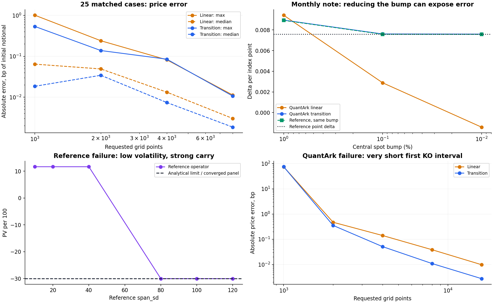
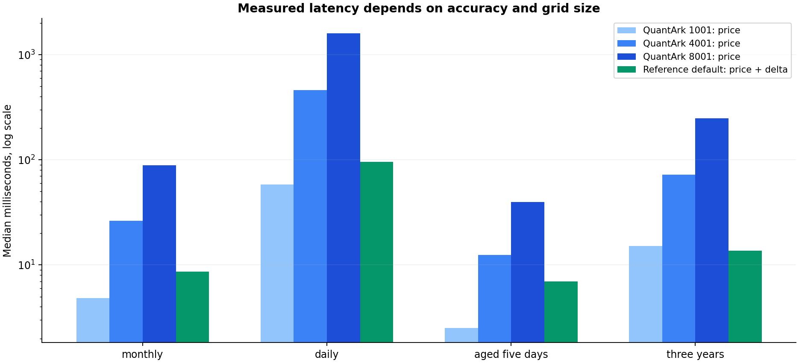

# Gaussian quadrature reference versus QuantArk Snowball QUAD

**The reference operator is the stronger numerical benchmark for the shared flat-GBM, discrete-observation contracts; QuantArk is the broader production engine and usually the faster default scalar pricer. Neither is reliable across all scenarios without numerical controls.** The reference can silently fail when drift moves the relevant states outside its default domain. QuantArk can materially misprice a short first KO interval because its adaptive grid considers KI spacing only. These two failures prevent an unconditional winner.

This report compares the exact file supplied in the request, not the older implementations in `docs/quad/ref_scripts`. The supplied file contains both `value_and_delta` (panel integration) and `value_and_delta_operator` (a reusable banded operator). Most reference results below use the operator; panel results are explicitly labelled. QuantArk is evaluated at commit `d926e1f54f4392a296cbbacc03c3bb232550bba5`. The reference was copied byte for byte to [quad_reference_snapshot.py](quad_reference_snapshot.py), SHA-256 `70938c07768f0512765bed99ca9d2c50dd561bb649fe595ebda90bbe3d090ac7`.

| Question | Finding |
| --- | --- |
| Accuracy in the 25 shared scenarios | Reference operator wins. It agrees with its refinement ladder, analytical controls, a separately discretized panel formulation, and Monte Carlo cross-checks. |
| Default scalar pricing speed | QuantArk wins for monthly, daily, and short-dated cases in the measured set; the reference operator is slightly faster for the three-year case. |
| High-accuracy price and delta | Reference operator is usually preferable in its supported scope. It avoids repeated bump repricing and is faster than the tested 4001/8001 QuantArk grids on several workloads. |
| Smooth point Greeks | Reference density delta wins. QuantArk's transition readout substantially improves results, but event projection, bump size, and moving mesh phase still matter. |
| Contract and workflow coverage | QuantArk wins: term inputs, reverse notes, continuous KI, settlement timing, lifecycle and event APIs. Some features require other QuantArk engines. |
| Robustness across all stresses | No unconditional winner. Both have concrete failure modes documented below. |

**What is actually matched.** The base contract has initial price and strike 100, one year remaining, r=3%, q=1%, volatility 20%, annual coupon 12%, KO=103 monthly and KI=75 monthly. The alive maturity payment is 12; the KI payment is `min(S_T-100,0)`; an early KO pays `12*t`. Both engines receive exactly the same observation times, barriers and signed cashflows. Payoff and resolved-schedule checks pass within floating-point precision for every matrix case. The reference and Monte Carlo payoffs are implemented independently of QuantArk.

All values are per 100 initial notional. **One basis point is 0.01 price unit.** Errors in basis points equal `100*(candidate-reference)`. Values normally exclude principal, prepayment, margin and funding legs; one explicitly labelled case includes principal at contractual redemption. For aged trades, accrued KO factors are explicitly `age+t` and the maturity rebate uses full contractual tenor. Already-KI reference cases reduce the two continuation branches to the KI branch; the supplied reference does not expose a lifecycle-state argument. Current spot below KI between observations does not create a historical KI.

**Why the methods differ.** Under the shared model, `X=log(S)` has an exact Gaussian increment with `m=(r-q-sigma²/2)*dt`, `v=sigma²*dt`. Both methods implement discounted backward expectation of an event-transformed value function. There is no Euler time-step bias in this comparison, and monitoring dates are not changed during numerical refinement.

The reference integrates smooth surviving and knocked-in continuation branches separately, splitting integration at active event thresholds. Its delta uses the differentiated Gaussian density:

$$V(S)=D\int F(y)p(y\mid\log S)\,dy,\qquad
\Delta(S)=\frac{D}{S}\int F(y)\frac{y-\log S-m}{v}p(y\mid\log S)\,dy.$$

The panel version evaluates Gauss–Legendre quadrature separately for each output point and uses cubic splines for smooth continuation. The operator version uses cellwise Gauss nodes, polynomial continuation, reusable banded transition kernels and sub-cell event integrals; constant KO regions use Gaussian CDFs. It does not interpolate a function across a KI or KO jump. A whole vector of spot queries shares one backward sweep.

QuantArk uses two nodal value arrays on a uniform log-price mesh, FFT convolution with trapezoid integration and spectral filtering, and cell-average event projection. Its default `legacy_linear` price interpolates the final nodal array in log spot. The optional `transition` readout evaluates the last discrete transition at the requested spot. This fixes the final interpolation defect but still uses the already projected event arrays. QuantArk's scalar delta/gamma come from central bump repricing; the default spot bump is 1%.

The panel cost is approximately `O(M*N*G*J)`, for M event intervals, N continuation points, G quadrature order and J event panels. The reference operator costs roughly `O(M*C*B*q²)` and materializes work arrays of size `O(C*B*q)`, where C is cells and B the transition bandwidth. QuantArk's discrete-KI sweep is roughly `O(M*N*log N)`, plus product construction/payoff work. These complexity expressions do not predict the timing winner at the small and medium grids actually used here; FFT factorization and dense-kernel implementation constants matter.

**Reference qualification.** Reference default settings are `(cells_per_sd=2, n_q=8, span_sd=10, n_gl=240, n_sd=9)`; medium uses `(3,10,10,360,9)`; fine uses `(4,12,12,480,10)`. The 25-case maximum default-to-fine difference is 2.371e-12 price units and 8.056e-13 delta units. This is a convergence observation, not a claimed universal error bound of that size. The drift-domain counterexample below shows why self-convergence is insufficient.

Four vanilla-put controls at rates -2%, 0%, 3%, and 10% agree with analytical prices and deltas to floating-point accuracy. Four single-observation KI/payoff controls agree with independent truncated-lognormal formulas; their analytical-price differences are below 3e-14. A no-event semigroup control agrees with a single European expectation. The same Monte Carlo harness also passes three deterministic zero-variance cashflow checks. These MC controls do not imply either quadrature engine supports zero volatility.

The panel formulation converges independently toward the operator on representative cases. Entries are signed panel PV minus fine operator PV, in price units:

| Case | 600 points | 1200 points | 2400 points | 4800 points |
| --- | --- | --- | --- | --- |
| monthly | -2.099e-06 | -1.292e-07 | -8.455e-09 | -5.013e-10 |
| aged_five_days | -3.496e-04 | -2.027e-05 | -1.240e-06 | -7.711e-08 |
| high_vol | +2.810e-06 | +1.741e-07 | +1.093e-08 | +6.865e-10 |
| step_down | -2.158e-06 | -1.340e-07 | -8.554e-09 | -4.870e-10 |

Five representative cases also pass independent domain and final-quadrature-order checks: reference span 10/12/16 and final Gauss order 120/240/480/960 give stable prices. QuantArk domain changes at fixed N also change mesh spacing and event phase, so they are sensitivity diagnostics rather than pure tail-truncation tests.

Monte Carlo uses exact GBM transitions at the contractual events, 8 independent scrambled Sobol replicates of 524,288 paths, **4,194,304 paths per case**, seed 20260911 plus replicate offsets. The 95% intervals use Student t with 7 degrees of freedom across replicate means. All nine reference prices, all nine analytical forwards and all nine vanilla-put controls lie inside their corresponding intervals. The intervals are wider than many deterministic-engine differences and cannot establish sub-basis-point accuracy by themselves.

| Case | Reference | MC mean | MC 95% interval | Reference minus MC, SE |
| --- | --- | --- | --- | --- |
| monthly | 1.910364 | 1.911734 | [1.907745, 1.915723] | -0.81 |
| daily | 1.340686 | 1.341012 | [1.333870, 1.348154] | -0.11 |
| daily_high_carry | -7.518045 | -7.520889 | [-7.532992, -7.508786] | +0.56 |
| near_ki_above | -17.507693 | -17.509346 | [-17.519573, -17.499119] | +0.38 |
| aged_five_days | -4.563212 | -4.562482 | [-4.564464, -4.560499] | -0.87 |
| high_vol | -9.228073 | -9.227896 | [-9.231241, -9.224551] | -0.12 |
| ko_disabled_after_ki | 1.905173 | 1.906410 | [1.902470, 1.910350] | -0.74 |
| step_down | 2.524686 | 2.526406 | [2.520949, 2.531864] | -0.75 |
| ki_ko_close | -1.912337 | -1.911634 | [-1.914659, -1.908608] | -0.55 |

**Price accuracy across the shared scenarios.** These are signed errors against the fine qualified operator, with no extrapolation or tolerance adjustment. `1001` is the requested QuantArk grid; its actual grid can be larger due to automatic KI resolution. Both engines price every contractual discrete observation in this matrix. BGK approximation is not enabled.

| Scenario | Reference PV / 100 | QA actual N for requested 1001 | QA 1001 linear error bp | QA 1001 transition error bp | QA 4001 transition error bp | QA 8001 transition error bp |
| --- | --- | --- | --- | --- | --- | --- |
| monthly | 1.910364003 | 1001 | -0.06888 | -0.00309 | -0.01076 | -0.00237 |
| daily | 1.340686148 | 1201 | -0.31094 | -0.25218 | -0.02361 | -0.00449 |
| weekly | 1.547494342 | 1001 | +0.06425 | +0.13412 | -0.01484 | -0.00303 |
| daily_high_carry | -7.518044926 | 1111 | -0.03928 | +0.09306 | +0.00659 | +0.00164 |
| near_ki_above | -17.507693489 | 1111 | -0.05757 | -0.06516 | +0.00475 | -0.00389 |
| near_ki_below_alive | -17.544497589 | 1111 | -0.05744 | -0.06522 | +0.00474 | -0.00388 |
| aged_five_days | -4.563212312 | 1001 | +0.05086 | +0.00096 | +0.00002 | +0.00000 |
| aged_already_ki | -10.192167351 | 1001 | +0.00052 | -0.00001 | +0.00000 | -0.00000 |
| low_spot | -37.626440199 | 1001 | +0.00239 | -0.00367 | +0.00019 | +0.00007 |
| high_spot | 1.231461808 | 1001 | +0.06532 | +0.04447 | +0.00146 | +0.00041 |
| low_vol | 9.399051487 | 1001 | -1.00999 | -0.53687 | -0.03516 | -0.00887 |
| high_vol | -9.228072702 | 1001 | -0.05023 | +0.01210 | +0.00091 | +0.00014 |
| negative_rate | 0.748225757 | 1001 | -0.07544 | +0.01154 | -0.01258 | -0.00273 |
| high_rate | 2.673496984 | 1001 | -0.04183 | -0.00748 | -0.00742 | -0.00165 |
| negative_carry | 2.691484745 | 1001 | -0.04757 | -0.00735 | -0.00835 | -0.00185 |
| already_ki | -1.912336596 | 1001 | -0.07754 | -0.00676 | -0.00054 | +0.00001 |
| ko_disabled_after_ki | 1.905173058 | 1001 | -0.06878 | -0.00269 | -0.01084 | -0.00238 |
| principal_included | 100.592206432 | 1001 | -0.04726 | +0.01848 | -0.00937 | -0.00202 |
| step_down | 2.524686222 | 1001 | -0.32042 | -0.12165 | +0.00258 | -0.00246 |
| irregular_daily | 1.333005318 | 1201 | -0.32312 | -0.25852 | -0.02417 | -0.00463 |
| three_months | 2.172687641 | 1001 | -0.01231 | -0.00524 | -0.00028 | -0.00012 |
| three_years | 0.860617920 | 1001 | -0.85704 | -0.30453 | -0.01876 | -0.00050 |
| ki_ko_close | -1.912336596 | 1001 | -0.12098 | +0.02450 | +0.08507 | +0.01065 |
| one_day_to_maturity | 11.998571514 | 1001 | +0.00000 | +0.00000 | +0.00000 | +0.00000 |
| ki_only_at_maturity | 2.780890640 | 1001 | -0.12689 | -0.07999 | -0.00740 | -0.00177 |

At default settings the maximum absolute price error is 1.010 bp; switching only the readout lowers that maximum to 0.537 bp. At 8001 points the maximum is approximately 0.011 bp. A small price error does not imply an accurate delta. Aggregate delta errors below compare 0.01% central spot bumps with reference point delta; the matched reference-bump diagnostic is retained separately to distinguish finite-bump error.

| Requested N | Readout | Median absolute PV error, bp | Maximum absolute PV error, bp | Median absolute delta error | Maximum absolute delta error |
| --- | --- | --- | --- | --- | --- |
| 1001 | legacy_linear | 0.06425 | 1.00999 | 0.0062356 | 0.0187510 |
| 1001 | transition | 0.01848 | 0.53687 | 0.0000898 | 0.0020192 |
| 2001 | legacy_linear | 0.04908 | 0.24010 | 0.0021948 | 0.0188701 |
| 2001 | transition | 0.03432 | 0.13822 | 0.0000570 | 0.0013736 |
| 4001 | legacy_linear | 0.01328 | 0.08214 | 0.0004443 | 0.0047555 |
| 4001 | transition | 0.00740 | 0.08507 | 0.0000164 | 0.0003598 |
| 8001 | legacy_linear | 0.00301 | 0.01128 | 0.0006564 | 0.0020260 |
| 8001 | transition | 0.00185 | 0.01065 | 0.0000034 | 0.0000886 |

Refinement is not reliably monotone for an individual case. For the monthly contract, transition prices at 1001/2001/4001/8001 are 1.910333140 / 1.909919916 / 1.910256384 / 1.910340351 versus 1.910364003. The lucky coarse-grid cancellation at 1001 does not certify its neighboring grid sizes. The step-down case retains a delta error around 0.00167 at 1001 with transition readout despite a price error of only -0.122 bp.



**Delta and gamma consistency.** For the monthly case, the reference point delta is 0.0075685524. QuantArk at 1001 points demonstrates why simply shrinking the bump is insufficient:

| Relative spot bump | Reference using same bump | QuantArk linear delta | QuantArk transition delta |
| --- | --- | --- | --- |
| 1% | 0.008925082 | 0.009422224 | 0.008950041 |
| 0.1% | 0.007582146 | 0.002885380 | 0.007608286 |
| 0.01% | 0.007568688 | -0.001406697 | 0.007594840 |

The linear readout's small-bump delta has the wrong sign here. Its 0.01%-bump gamma is +0.0000141 versus the reference -0.0392434; transition gives -0.0392093. Linear interpolation in log spot creates a piecewise `a+b*log(S)` price, so within a cell the computed curvature can be dominated by the interpolant rather than the option's economic curvature.

For the aged five-day note near KI, point delta is 4.81574447 while the reference's own 1% central-bump delta is 4.68457470, a 2.72% difference. QuantArk transition gives 4.68414475 at that same bump, close to the matched reference. Much of the gap to point delta in this example is the bump convention. At a 0.01% bump, transition gives 4.81523760 and the matched reference gives 4.81573075. Use common bump ladders before attributing a hedge discrepancy to the engine.

The reference returns analytic density delta but no public analytic gamma; gamma validation here differentiates its delta along a converged spot-bump ladder. Neither engine's vega, rho, theta or bucket risks are certified by this report.

**API and event consistency.** QuantArk's `calculate_spot_greeks_curve` uses the stored nodal grid and numerical gradients even when scalar pricing uses `readout="transition"`. On the monthly 21-spot probe, its curve and scalar transition prices differ by up to 0.190 bp; maximum curve delta error is 0.000911, versus 0.0000424 for directly repriced transition deltas on the same spots. It is a useful fast approximation with different finite-grid behavior, not the identical scalar pricing function. The reference vector query shares the same density readout for every spot; mesh-domain changes from including more query spots should still be checked.

QuantArk's event PV, cashflow sum and scalar PV reconcile in all three tested cases and both readouts. However, `expected_discounted_maturity_cf = pv - sum(ed_ko_cf)` in the implementation: zero reconciliation error is partly an accounting identity. It does not independently validate KO probabilities, maturity attribution or total PV. Explicit event statistics are a useful QuantArk capability that the supplied reference does not expose.

**Failure 1: reference domain excludes the economically relevant states.** Set S=100, T=1, r=3%, q=40%, volatility=0.5%, monthly KO=103, monthly KI=75 and coupon=12%. The operator chooses a spot-centered domain based on `span_sd*sigma*sqrt(T)` without drift. Its default log half-width is only 0.05, but expected log drift is about -0.37 and KI lies at log(0.75)=-0.288. Refining cell order inside that domain cannot recover the missing regime.

| Reference span_sd | Reference PV |
| --- | --- |
| 10 | +11.64534640 |
| 20 | +11.64534640 |
| 40 | +11.64534640 |
| 80 | -30.01254875 |
| 100 | -30.01254875 |
| 120 | -30.01254875 |

The wide-domain panel gives -30.0125487513, QuantArk transition at 4001 gives -30.0125487443, and the negative European-put limiting control gives -30.0125487513. Default-reference error is about **41.658 price units, or 4165.79 bp of notional**. The reference's default 10-to-12 domain/refinement ladder alone would falsely look stable. A robust reference must include drift and relevant event/payoff levels in domain construction and actively test tails.

**Failure 2: QuantArk misses a short KO diffusion interval in adaptive sizing.** Set S=103.001, r=3%, q=1%, volatility=20%, T=1, KO times `[0.0001,0.5,1]` at 103, and KI only at T at 75. The first KO is roughly 0.0252 trading day ahead. Panel prices at 1200/2400/4800 converge to 3.2277326782; analytic-density delta converges to -12.5304812116. QuantArk's grid resolver receives only KI times and therefore does not refine for the first KO.

| Requested N | Linear PV | Transition PV | Transition price error, bp |
| --- | --- | --- | --- |
| 1001 | 3.976585407 | 3.981385376 | +75.36527 |
| 2001 | 3.232454262 | 3.231269161 | +0.35365 |
| 4001 | 3.229139208 | 3.228242819 | +0.05101 |
| 8001 | 3.228117058 | 3.227841365 | +0.01087 |
| 16001 | 3.227830569 | 3.227760067 | +0.00274 |

Transition readout is not a substitute for resolving the diffusion kernel. Size the mesh from every merged KO/KI/maturity interval and its forward variance. The supplied reference operator also becomes costly when one tiny interval forces an extremely fine mesh for all other intervals; the panel form is the practical control used here.

**Other limits and convergence controls.** The operator's exact-float set union does not merge near-coincident event dates, although its event lookup uses a tolerance. A KO at `0.25+1e-14` beside KI at `0.25` implies about 400 million reference cells at default resolution. This was diagnosed from mesh sizing without allocating that mesh. Dates need canonicalization before calling the reference. Exact zero volatility is unsupported by these public Snowball pricing paths; QuantArk rejects it and the reference lacks a deterministic branch.

QuantArk's `auto_converge` checks successive PVs, not a certified error bound or Greek accuracy. In the near-coincident KI=102.9 / KO=103 case it accepts 4001 points with an estimated 0.01482 bp difference, while error to the qualified reference is 0.08507 bp. Its tolerance also scales with total PV, including any principal. Use independent error targets in notional units, domain/phase tests and Greek convergence in addition to this stop rule.

**Performance at the actual workloads.** Timings below are median wall-clock milliseconds over seven repetitions after warmup. Python/import initialization is excluded, and pricing runs rebuild their numerical work rather than retrieving a cached quote. QuantArk product/environment construction is outside timed engine calls; the reference timing includes its thin adapter and mesh metadata construction. All study timing jobs run serially with `OPENBLAS_NUM_THREADS=1`, `OMP_NUM_THREADS=1`, `VECLIB_MAXIMUM_THREADS=1`; host scheduling and thermal noise remain. Environment: Python 3.11.8, NumPy 2.4.6, SciPy 1.17.1, macOS ARM64. Every timing sample is saved.

The QuantArk columns return **price only**; reference columns return **price and analytic delta together**, its public operator workload. The reference default is already converged in this matrix; equal node counts would not be an equal-accuracy comparison.

| Case | QA transition 1001, ms | QA transition 4001, ms | QA transition 8001, ms | Reference default PV+delta, ms | Reference fine PV+delta, ms |
| --- | --- | --- | --- | --- | --- |
| monthly | 4.85 | 26.31 | 89.13 | 8.62 | 25.43 |
| daily | 58.04 | 460.01 | 1600.06 | 95.31 | 241.25 |
| aged_five_days | 2.52 | 12.47 | 39.83 | 6.96 | 19.86 |
| three_years | 15.11 | 72.32 | 247.63 | 13.65 | 49.84 |

QuantArk default linear scalar medians are 4.77 ms monthly, 70.75 ms daily, 2.06 ms aged-five-day, and 14.69 ms three-year; use the raw JSON for ranges and exact values. Reference default operator is about 103 times faster than its own default panel function on the monthly case: 8.62 ms versus 884.54 ms. On the aged case the panel takes 224.56 ms versus 6.96 ms for the operator. Choosing the panel function would give a very different performance ranking for the same supplied file.

Price-and-Greek timing is also recorded separately. Monthly QuantArk transition at 1001 takes 14.59 ms for price/delta/gamma via three repricings versus reference price/delta at 8.62 ms. This comparison includes an additional gamma output for QuantArk and uses its default finite bump; it is not a claim that the delivered Greeks have equal accuracy.



A 101-spot curve reuses one sweep in each API. Reference returns pointwise density deltas; QuantArk at 4001 uses interpolation and grid gradients, with the consistency limitation above:

| Case | Reference default 101-spot PV+delta, ms | QuantArk 4001 grid curve, ms |
| --- | --- | --- |
| monthly | 22.37 | 26.90 |
| daily | 101.14 | 459.72 |
| aged_five_days | 16.15 | 12.69 |
| three_years | 27.59 | 72.27 |

FFT length is a material implementation sensitivity. At 8001 nodes QuantArk uses transform length 32002; its large prime factor makes NumPy FFT slower. At 7813 nodes the transform length is 31250, which factors into small primes. Without changing engine code:

| Case | QA 8001 transition price, ms | QA 7813 transition price, ms | QA 7813 error, bp |
| --- | --- | --- | --- |
| monthly | 89.13 | 28.14 | -0.00168 |
| daily | 1600.06 | 453.67 | -0.00074 |

Thus the tested high-grid latency improves by roughly threefold just from a nearby grid size. Mesh-phase cancellation also changes prices, so grid selection must be justified by accuracy, not chosen solely for speed or a lucky price. The reference operator remains faster than these 7813-point QuantArk measurements in the two tested cases. A production FFT implementation using suitable padded lengths could improve this tradeoff further; that optimization was not implemented here.

**Coverage is a separate dimension from numerical accuracy.** A missing feature is not a mispricing comparison. The following combines inspected API coverage with the focused regression tests; it is not external certification of every feature.

| Feature | Supplied reference panel | Supplied reference operator | QuantArk Snowball QUAD |
| --- | --- | --- | --- |
| Flat r/q/vol, standard down-KI/up-KO | Yes | Yes | Yes |
| Irregular discrete dates, KO step-down | Yes, with date hygiene | Yes, short steps can be expensive | Yes, but adaptive sizing gap noted above |
| Multiple terminal payoff kinks / loss cap | Caller supplies all breaks | Explicitly rejects more than one terminal break | Product payoff support; loss-cap comparison run |
| Already KI | Algebraic payoff adapter required | Algebraic payoff adapter required | Lifecycle support |
| Reverse up-KI/down-KO | No native direction parameter | No native direction parameter | Yes |
| Time-varying deterministic rates/carry/variance | Market accepts scalar values only | Market accepts scalar values only | Per-interval term inputs |
| Continuous KI / BGK approximation | No | No | Brownian bridge; BGK is explicit opt-in; transition readout refuses continuous KI |
| Settlement delays | Caller must pre-discount/resolve cashflows | Same | Native event and terminal timing |
| Event probabilities / cashflow distribution | No public API | No public API | Yes |
| Valuation-date observation / expiry handling | Positive future times required | Positive future times required | Native lifecycle and immediate-event handling |
| Phoenix coupons, memory, KO reset | Not represented by this Deal | Not represented by this Deal | Requires the separate appropriate QuantArk engine; not this comparison's Snowball engine |
| Heston / local-volatility dynamics | No | No | This Gaussian QUAD engine is not a stochastic/local-vol solver |

**Recommended use.** Use QuantArk for production integration and broad contractual coverage. For ordinary prices its default configuration is a useful fast starting point, with an explicit per-product accuracy gate. For discrete-KI delta work, evaluate `readout="transition"`, choose spatial resolution using the full event calendar, and validate matched bump ladders; do not silently change existing marks, goldens or hedge sizes on the basis of this report. Use the supplied operator as an independent price/delta benchmark for its supported contracts only after a drift-aware domain check, date canonicalization and an analytical/MC control. Use the panel version when the operator cannot handle multiple payoff breaks or when a tiny interval makes its mesh impractical.

The highest-priority QuantArk improvements are complete-event adaptive sizing, consistent scalar/curve readout, and convergence checks that separate PV accuracy from Greek accuracy. The highest-priority reference improvements are drift-aware domain construction, finite/positive input checks, tolerant event-time merging, explicit lifecycle/direction semantics and a deterministic zero-variance path. FFT-length optimization is worthwhile after correctness. No production changes are included in this analysis.

**Reproduction and artifacts.** Run from the repository root. The original external reference is preserved in a local snapshot so the study does not depend on the temporary directory surviving. Full inputs, source hashes, actual grids, bumped prices, confidence intervals and timing repetitions are in [results](results/). CSV exports are [price_comparison.csv](results/price_comparison.csv) and [timing_comparison.csv](results/timing_comparison.csv). The 74 focused existing tests passed; output is [pytest.txt](results/pytest.txt).

```sh
export OPENBLAS_NUM_THREADS=1 OMP_NUM_THREADS=1 VECLIB_MAXIMUM_THREADS=1
.venv/bin/python example/gaussian_quad_comparison/study.py --phase controls
.venv/bin/python example/gaussian_quad_comparison/study.py --phase matrix
.venv/bin/python example/gaussian_quad_comparison/study.py --phase mc --only monthly,daily,daily_high_carry,near_ki_above,aged_five_days,high_vol,step_down,ki_ko_close,ko_disabled_after_ki --power 19 --replicates 8
.venv/bin/python example/gaussian_quad_comparison/study.py --phase diagnostics --only monthly,near_ki_above,aged_five_days,high_vol,ki_ko_close
.venv/bin/python example/gaussian_quad_comparison/supplement.py --phase edges
.venv/bin/python example/gaussian_quad_comparison/supplement.py --phase greeks --only monthly,near_ki_above,aged_five_days,ki_ko_close
.venv/bin/python example/gaussian_quad_comparison/supplement.py --phase events --only monthly,near_ki_above,aged_five_days
.venv/bin/python example/gaussian_quad_comparison/study.py --phase benchmark --only monthly,daily,aged_five_days,three_years
.venv/bin/python example/gaussian_quad_comparison/extra_checks.py
.venv/bin/python example/gaussian_quad_comparison/build_report.py
.venv/bin/python -m pytest -n0 -q test/test_snowball_quad_engine.py test/test_quad_readout.py test/test_quad_term_structure_engines.py test/test_snowball_lifecycle_ki.py test/test_quad_event_stats_smoothing.py
```

These are a scenario study and identified failure cases, not exhaustive engine-release certification. Timing is machine dependent. Reference self-convergence is not a statistical confidence interval. Monte Carlo intervals describe sampling uncertainty, not numerical model misspecification. No live market calibration, settlement-specific external repricing, continuous-KI external accuracy ladder, smile dynamics, or non-spot Greek certification is claimed.

**Scenario details.** Full arrays and coupon/principal/lifecycle flags are in matrix.json. All unspecified KO levels are 103; step-down uses 110 to 90 over 12 dates; irregular daily uses day indices 17/43/64/85/110/132/150/175/196/217/238/252. Daily high-carry and related near-KI/aged cases use an 18% annual coupon; other cases use 12%. Aged cases preserve a one-year original tenor.

| Scenario | Spot | Remaining T | r | q | vol | KI | KO count | KI count |
| --- | --- | --- | --- | --- | --- | --- | --- | --- |
| monthly | 100.0 | 1.000000 | 3% | 1% | 20% | 75.0 | 12 | 12 |
| daily | 100.0 | 1.000000 | 3% | 1% | 20% | 75.0 | 12 | 252 |
| weekly | 100.0 | 1.000000 | 3% | 1% | 20% | 75.0 | 12 | 52 |
| daily_high_carry | 100.0 | 1.000000 | 2% | 14% | 26% | 90.0 | 12 | 252 |
| near_ki_above | 90.018 | 1.000000 | 2% | 14% | 26% | 90.0 | 12 | 252 |
| near_ki_below_alive | 89.982 | 1.000000 | 2% | 14% | 26% | 90.0 | 12 | 252 |
| aged_five_days | 90.018 | 0.019841 | 2% | 14% | 26% | 90.0 | 1 | 5 |
| aged_already_ki | 90.018 | 0.019841 | 2% | 14% | 26% | 90.0 | 1 | 5 |
| low_spot | 60.0 | 1.000000 | 3% | 1% | 20% | 75.0 | 12 | 12 |
| high_spot | 110.0 | 1.000000 | 3% | 1% | 20% | 75.0 | 12 | 12 |
| low_vol | 100.0 | 1.000000 | 3% | 1% | 3% | 75.0 | 12 | 12 |
| high_vol | 100.0 | 1.000000 | 3% | 1% | 60% | 75.0 | 12 | 12 |
| negative_rate | 100.0 | 1.000000 | -2% | 1% | 20% | 75.0 | 12 | 12 |
| high_rate | 100.0 | 1.000000 | 10% | 1% | 20% | 75.0 | 12 | 12 |
| negative_carry | 100.0 | 1.000000 | 3% | -5% | 20% | 75.0 | 12 | 12 |
| already_ki | 100.0 | 1.000000 | 3% | 1% | 20% | 75.0 | 12 | 12 |
| ko_disabled_after_ki | 100.0 | 1.000000 | 3% | 1% | 20% | 75.0 | 12 | 12 |
| principal_included | 100.0 | 1.000000 | 3% | 1% | 20% | 75.0 | 12 | 12 |
| step_down | 100.0 | 1.000000 | 3% | 1% | 20% | 75.0 | 12 | 12 |
| irregular_daily | 100.0 | 1.000000 | 3% | 1% | 20% | 75.0 | 12 | 252 |
| three_months | 100.0 | 0.250000 | 3% | 1% | 20% | 75.0 | 3 | 3 |
| three_years | 100.0 | 3.000000 | 3% | 1% | 20% | 75.0 | 36 | 36 |
| ki_ko_close | 100.0 | 1.000000 | 3% | 1% | 20% | 102.9 | 12 | 12 |
| one_day_to_maturity | 99.98 | 0.003968 | 3% | 1% | 20% | 75.0 | 1 | 1 |
| ki_only_at_maturity | 100.0 | 1.000000 | 3% | 1% | 20% | 75.0 | 12 | 1 |

**Implementation evidence.** The relevant code locations are [reference panel](quad_reference_snapshot.py#L169), [reference operator](quad_reference_snapshot.py#L499), [reference mesh/domain](quad_reference_snapshot.py#L517), [QuantArk event projection and readout](../../quantark/asset/equity/engine/quad/snowball_quad_engine.py:331), [adaptive grid](../../quantark/asset/equity/engine/quad/snowball_quad_engine.py:1460), [term inputs](../../quantark/asset/equity/engine/quad/term_inputs.py:29), [bump Greeks](../../quantark/asset/equity/engine/base_engine.py:221), [grid curve](../../quantark/asset/equity/engine/base_engine.py:298), [residual maturity cashflow](../../quantark/asset/equity/engine/quad/snowball_quad_engine.py:1264), and [QUAD defaults](../../quantark/asset/equity/param/engine_params.py:767).
