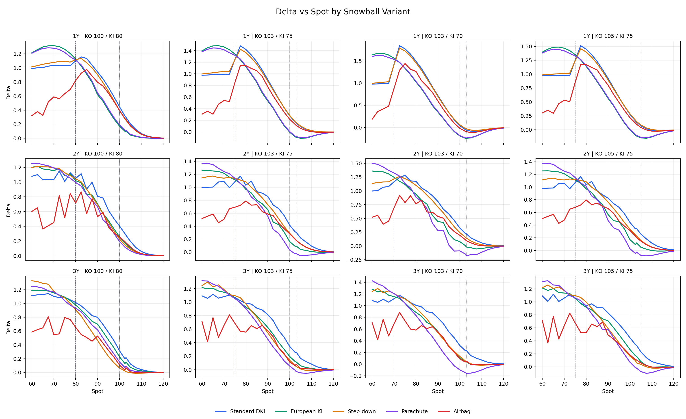
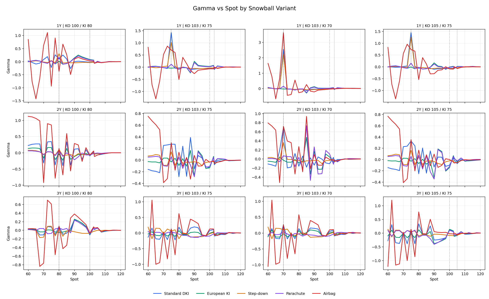
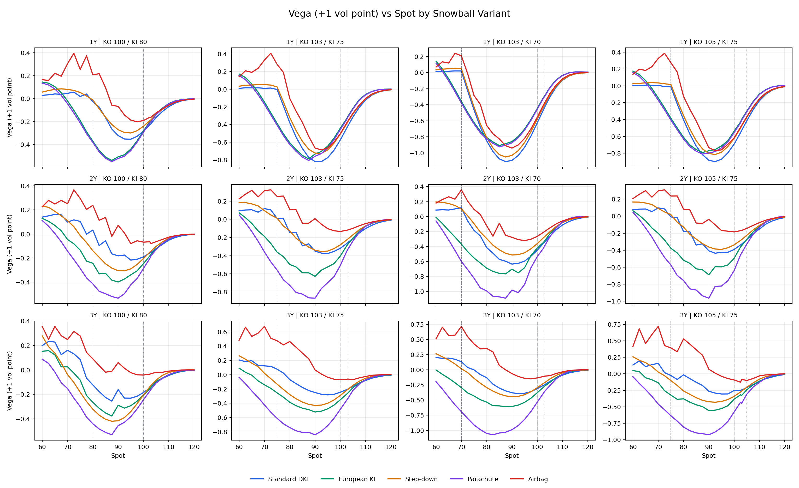
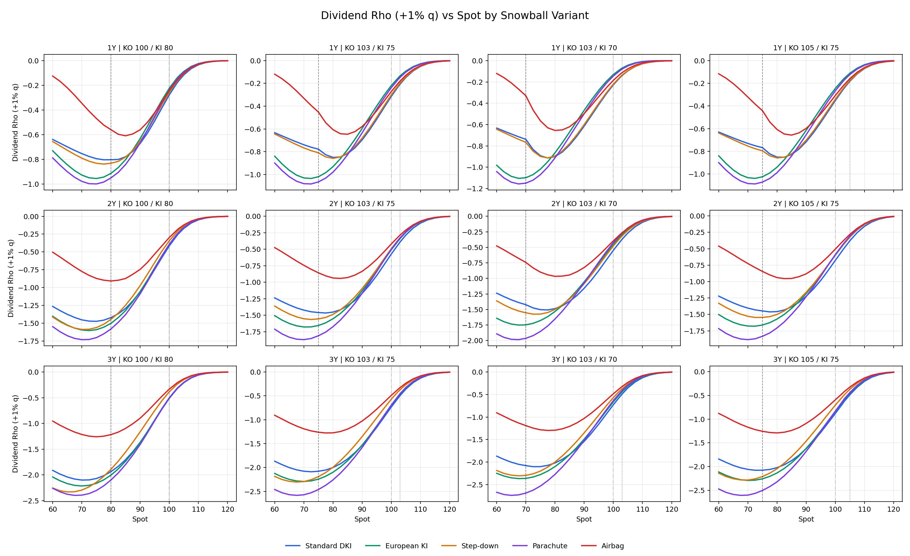

# Snowball Greeks vs Spot Comparison - Quad 1001

## Scope

This report compares Snowball Greeks as line charts over spot for five Snowball variants, three tenors (1Y, 2Y, 3Y), and four KO/KI barrier combinations. Pricing uses `SnowballQuadEngine` with `QuadParams(grid_points=1001)`.

## Method

- Market: S0=100, strike=100, flat volatility=22%, risk-free rate=2%, dividend yield=3%.
- Payoff convention: ex-principal, annual KO coupon=15%, monthly KO observations.
- Greeks: finite-difference `GreeksCalculator`; spot bump=0.50%, vol bump=1.00%, rate/dividend bump=0.01%/0.01%.
- Vega is shown as the price change for a +1 vol point bump; dividend rho is price change for a +1% dividend-yield shift.

## Product Variants

| Variant | Definition |
| --- | --- |
| Standard DKI | Standard Snowball, continuous down-and-in monitoring. |
| European KI | European KI Snowball, KI checked only at maturity. |
| Step-down | Step-down Snowball, KO barrier decreases 0.5% of initial per month. |
| Parachute | Parachute Snowball, final KO barrier drops to the KI level. |
| Airbag | Airbag Snowball, reduced participation below 60% spot. |

## KO/KI Combinations

| Combination | KO | KI |
| --- | --- | --- |
| KO 100 / KI 80 | 100.0 | 80.0 |
| KO 103 / KI 75 | 103.0 | 75.0 |
| KO 103 / KI 70 | 103.0 | 70.0 |
| KO 105 / KI 75 | 105.0 | 75.0 |

## Key Readouts

- The strongest Gamma concentration appears at S=70.00 for Airbag 1Y (KO 103 / KI 70), with Gamma=3.63823.
- The largest absolute Vega in this grid is -1.1097 at S=87.50 for Standard DKI 1Y (KO 103 / KI 70).
- The largest absolute dividend sensitivity is -2.7367 at S=65.00 for Parachute 3Y (KO 103 / KI 70).
- At S=100 under the base KO 103 / KI 75 structure, 1Y Delta range -0.0021 to 0.2860; 2Y Delta range 0.0333 to 0.4165; 3Y Delta range 0.0547 to 0.3436.

## Base Spot Table

Base point: S=100, KO 103 / KI 75.

| Tenor | Variant | Price | Delta | Gamma | Vega | DivRho |
| --- | --- | --- | --- | --- | --- | --- |
| 1Y | Airbag | 0.4781 | 0.2203 | -0.06953 | -0.5031 | -0.2717 |
| 1Y | European KI | 2.4857 | -0.0021 | 0.02950 | -0.4406 | -0.2190 |
| 1Y | Parachute | 2.3778 | 0.0083 | 0.01751 | -0.4559 | -0.2376 |
| 1Y | Standard DKI | 0.1161 | 0.2794 | -0.04955 | -0.5741 | -0.3139 |
| 1Y | Step-down | -0.0001 | 0.2860 | -0.03480 | -0.5073 | -0.3010 |
| 2Y | Airbag | -0.2921 | 0.2843 | -0.03525 | -0.1334 | -0.4211 |
| 2Y | European KI | 0.6300 | 0.1632 | -0.13255 | -0.4032 | -0.5081 |
| 2Y | Parachute | 1.8087 | 0.0333 | -0.10874 | -0.5069 | -0.5004 |
| 2Y | Standard DKI | -1.4868 | 0.4165 | -0.13038 | -0.3183 | -0.5733 |
| 2Y | Step-down | -0.2745 | 0.2922 | -0.03189 | -0.2807 | -0.4923 |
| 3Y | Airbag | 0.7396 | 0.1128 | 0.13126 | -0.0679 | -0.4898 |
| 3Y | European KI | 0.4147 | 0.1954 | -0.00679 | -0.3501 | -0.6988 |
| 3Y | Parachute | 1.8355 | 0.0547 | -0.09615 | -0.4835 | -0.6916 |
| 3Y | Standard DKI | -1.0486 | 0.3436 | 0.07926 | -0.2450 | -0.7338 |
| 3Y | Step-down | 1.1444 | 0.1388 | -0.02251 | -0.2897 | -0.5706 |

## Main Line Charts

Chart markers: dashed vertical line = KI barrier, dotted vertical line = KO barrier, dash-dot vertical line = S0.

### Delta

### Gamma

### Vega (+1 vol point)

### Dividend Rho (+1% q)

## KO/KI Appendix Charts

Appendix charts compare KO/KI combinations for each variant and tenor. They are saved under `plots/combo_slices/` in the output directory.

## Artifacts

- Data cube: `snowball_greeks_spot_data.csv`
- Metadata: `metadata.json`
- Runtime: 188.2 seconds with 8 workers.
