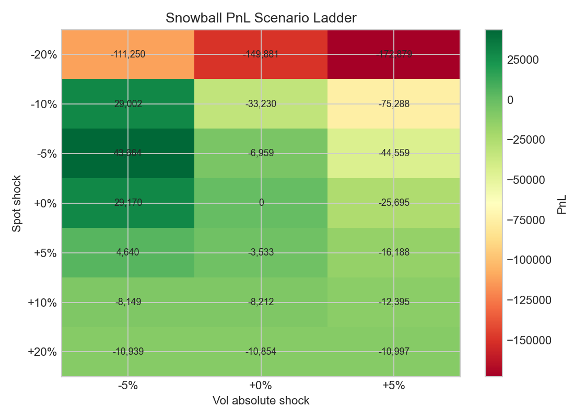
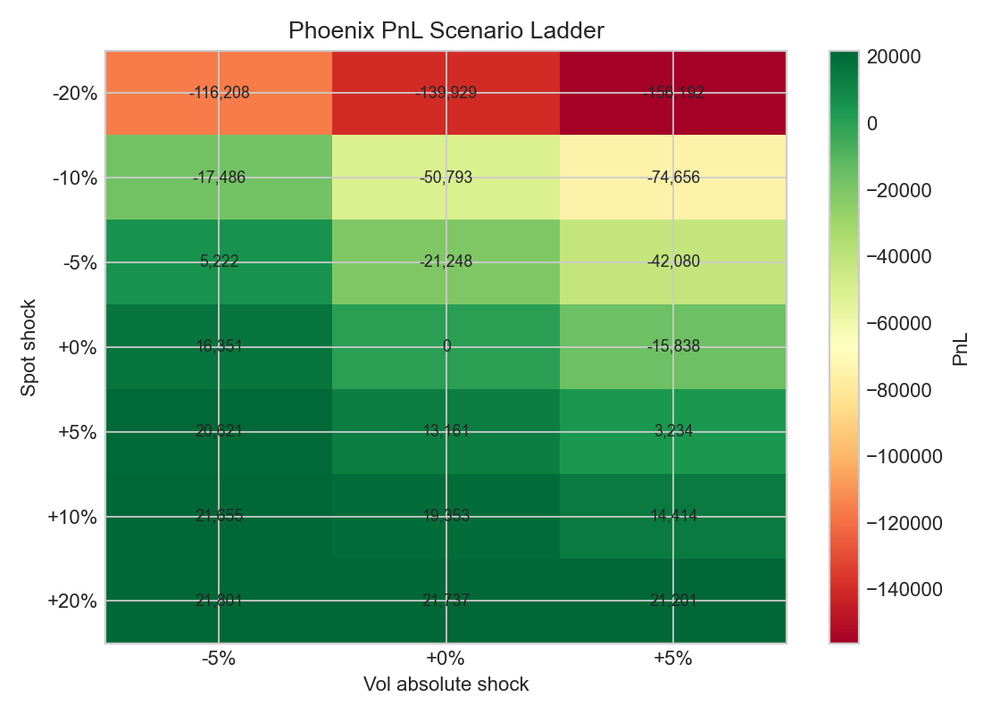
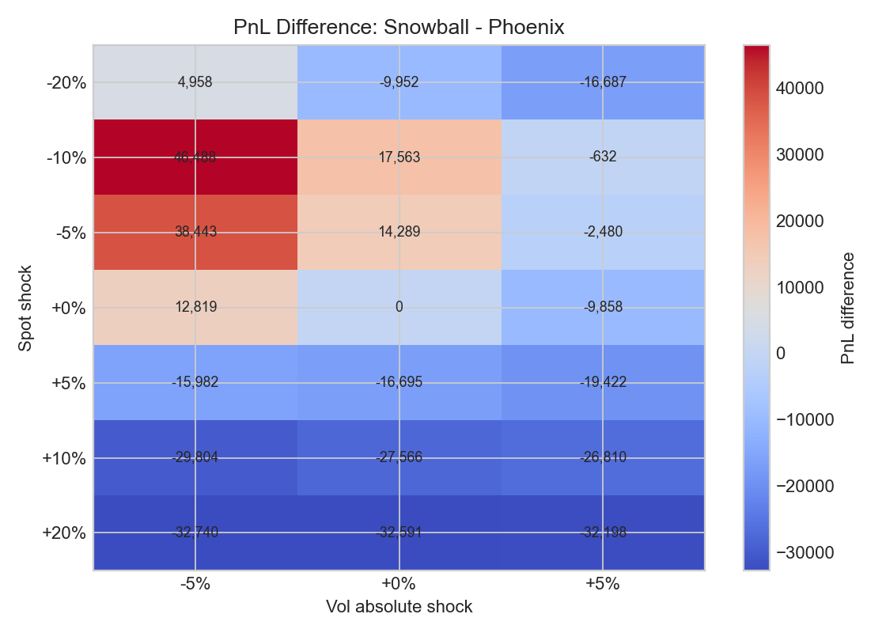
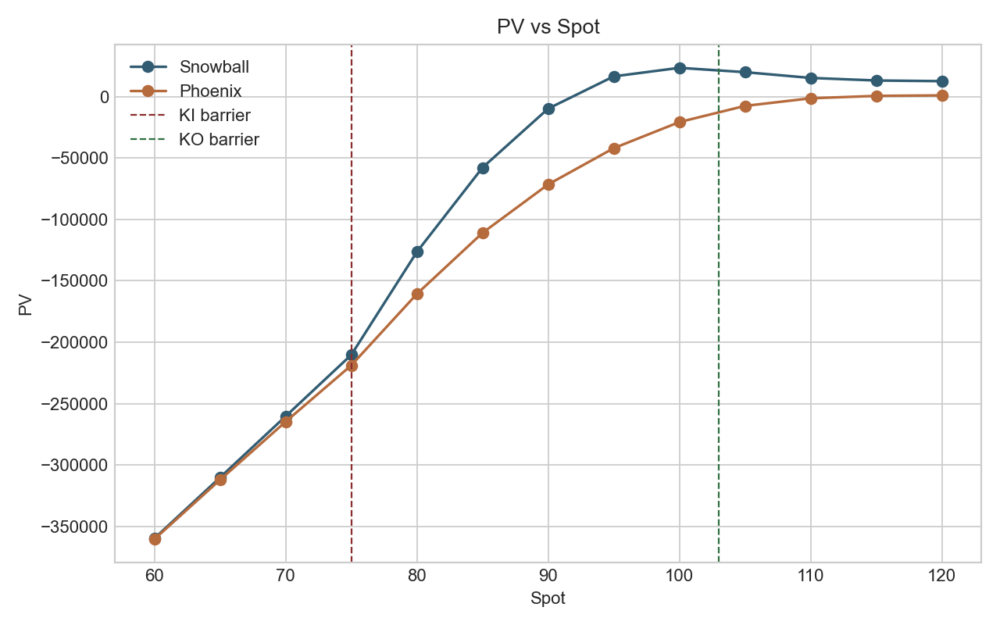
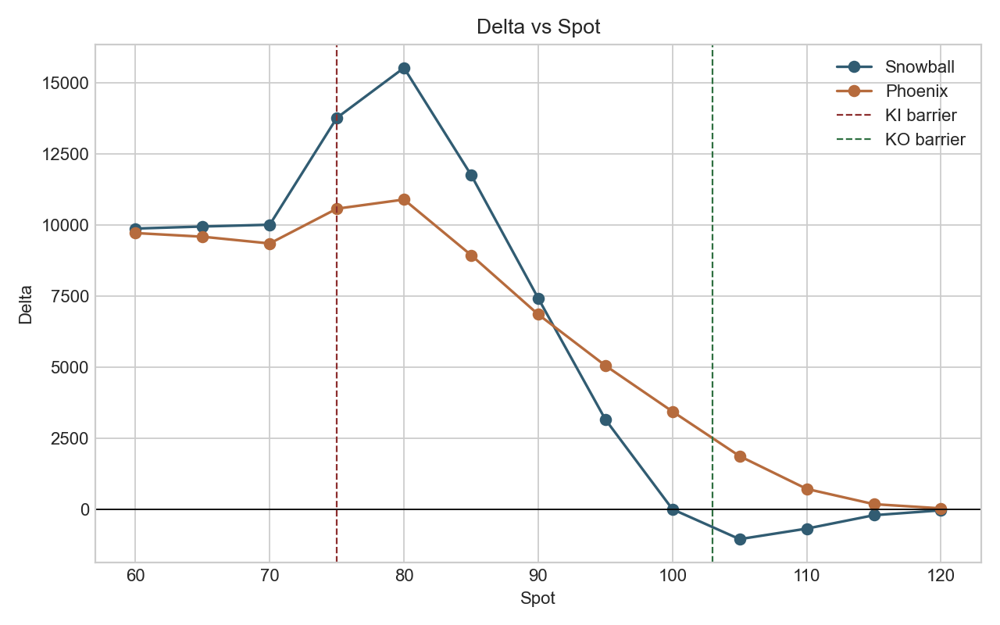
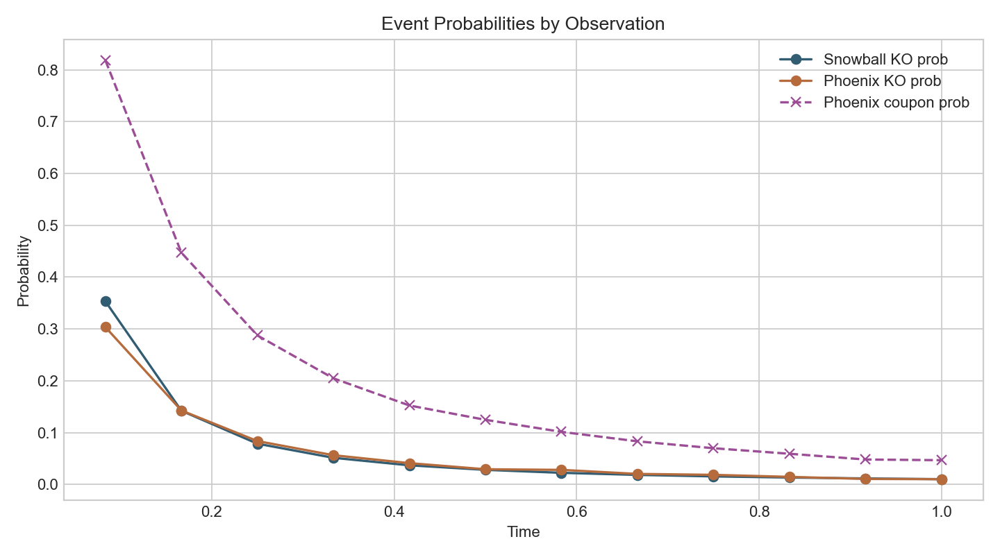

# Snowball vs Phoenix Risk Comparison Report

Generated: 2026-04-28 16:29:31

## Executive Summary

This report compares a standard Snowball autocallable against a comparable standard Phoenix autocallable under matched synthetic market assumptions. Both structures use the same underlying, 1Y maturity, 12 monthly KO observations, KO barrier of 103, KI barrier of 75, strike/reference spot of 100, and contract multiplier of 10,000.

The base PV difference is **44,159.80** (Snowball minus Phoenix). The Phoenix receives periodic coupon opportunities at a 95 coupon barrier with memory coupons, while the Snowball coupon is tied to autocall/terminal economics. This structural coupon timing difference is the main interpretation boundary for the comparison.

## Product Terms

| Field                | Snowball                       | Phoenix                              |
|:---------------------|:-------------------------------|:-------------------------------------|
| Product              | SnowballOption                 | PhoenixOption                        |
| Maturity             | 1Y                             | 1Y                                   |
| Observation schedule | Monthly KO, 12 obs             | Monthly KO/coupon, 12 obs            |
| Reference / strike   | 100 / 100                      | 100 / 100                            |
| KO barrier           | 103                            | 103                                  |
| KI barrier           | 75 continuous                  | 75 continuous                        |
| Coupon economics     | 15% annualized KO/accrual rate | 1.25% monthly coupon, memory enabled |
| Multiplier           | 10,000                         | 10,000                               |

## Market Snapshot

| field          | value      |
|:---------------|:-----------|
| valuation_date | 2026-04-28 |
| spot           | 100.0      |
| volatility     | 0.2        |
| risk_free_rate | 0.05       |
| dividend_yield | 0.02       |

## PV and Local Greeks

| product            | price        | delta       |    gamma | vega_per_1pct_vol   |   theta_per_day | rho_per_1pct_rate   | dividend_rho_per_1pct_q   | basis_rho_per_1pct_basis   |
|:-------------------|:-------------|:------------|---------:|:--------------------|----------------:|:--------------------|:--------------------------|:---------------------------|
| Snowball           | 23,395.9281  | -1.7112     | -184.819 | -5,749.2027         |         69.5663 | 1,918.3965          | -1,977.2799               | 1,977.2799                 |
| Phoenix            | -20,763.8674 | 3,436.3328  | -411.377 | -3,373.7941         |         65.1775 | 2,385.1609          | -2,135.4952               | 2,135.4952                 |
| Snowball - Phoenix | 44,159.7955  | -3,438.0439 |  226.558 | -2,375.4086         |          4.3888 | -466.7644           | 158.2153                  | -158.2153                  |

Units: PV and Greeks are per contract at multiplier 10,000. Vega, Rho, and dividend Rho are reported per 1% absolute move in volatility, rate, and dividend yield respectively. Theta is one calendar day roll-down.

## Scenario Ladder

Worst Snowball scenario in the grid: spot shock **-20%**, vol shock **+5%**, PnL **-172,878.72**.

Worst Phoenix scenario in the grid: spot shock **-20%**, vol shock **+5%**, PnL **-156,192.13**.

Scenario data is saved in `data/scenario_ladder.csv`.

## Spot Risk Curves

## Event and Cashflow Diagnostics

| product   | pv_from_event_stats   |   ko_probability_total |   final_survival_probability |   ki_probability | expected_discounted_ko_cashflow   | expected_discounted_coupon_cashflow   | expected_discounted_maturity_cashflow   |   reconciliation_error | event_stats_method                    |
|:----------|:----------------------|-----------------------:|-----------------------------:|-----------------:|:----------------------------------|:--------------------------------------|:----------------------------------------|-----------------------:|:--------------------------------------|
| Snowball  | 23,395.9281           |                 0.781  |                       0.219  |           0.0994 | 27,526.8846                       | 0.0000                                | -4,130.9566                             |                      0 | Quad deterministic                    |
| Phoenix   | -19,960.0306          |                 0.7579 |                       0.2421 |           0.136  | 0.0000                            | 3,607.9352                            | -23,567.9658                            |                      0 | Phoenix MC diagnostics via engine API |

## Methodology

- Primary PV engine: `SnowballQuadEngine` / `PhoenixQuadEngine` with `QuadParams(grid_points=501, num_std_devs=8.0)`.
- Local Greeks: central finite differences around the quadrature PV.
- Event diagnostics: deterministic quadrature event stats for Snowball; Phoenix event diagnostics through the Phoenix engine API, which delegates event stats to Monte Carlo diagnostics.
- Market data: synthetic wizard defaults, not live market data.
- Comparison normalization: same underlying, maturity, observation count, KO/KI levels, strike/reference, multiplier, and pricing environment.

## Warnings and Limitations

- The existing `asset.equity.report.autocallable_risk_report` CLI is Snowball-only and validates `SnowballOption`; this report uses product/engine APIs directly for Phoenix compatibility.
- Phoenix coupon economics are comparable by annualized target economics, not identical payoff mechanics. Phoenix pays periodic coupons when the coupon barrier is met; Snowball coupon economics are linked to KO/accrual behavior.
- Synthetic assumptions are for workflow validation and should be replaced with production market data before risk decisions.
- Finite-difference Greeks around barriers can be grid-sensitive; use PDE/MC cross-checks before production use.

## Output Files

- `risk_report.md`
- `data/assumptions.csv`
- `data/pv_greeks.csv`
- `data/scenario_ladder.csv`
- `data/event_summary.csv`
- `data/event_by_observation.csv`
- `data/spot_curves.csv`
- `charts/*.png`
